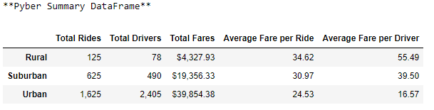
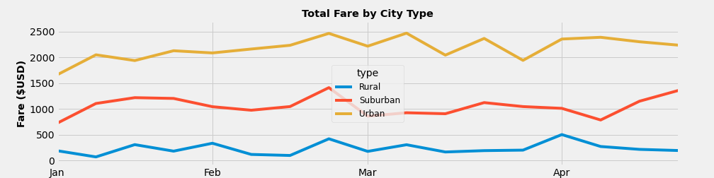

# PyBer_Analysis

## Overview of Analysis
### Purpose

The purpose of this analysis was to assess how ride sharing data for Pyber differs based on the city type (i.e. urban, suburban, rural). In particular, it looks at the amount of rides, drivers, and fare totals and averages of each city type to see if there is any correlation. Finally, this analysis weighs in with helpful recommendations on how these differences can be leveraged by decision-makers at PyBer.

## Results
### Pyber Summary DataFrame

Below is an image of the Pyber Summary DataFrame (based on Pyber data taken January 2019 through April 2019). From this, we can see:
- Urban cities have the highest total rides, highest total drivers, and highest total fares.
- Suburban cities have the second highest numbers for total rides, total drivers, and total fares.
- Rural cities have the lowest number of total rides, total drivers, and total fares.

Additionally, the Pyber Summary DataFrame also shows:
- Urban cities on average have the lowest fare per ride and fare per driver,
- suburban cities have the second lowest, and
- rural cities have the highest averages.

The multiple-line graph image below shows the total weekly fares for each city type.

### Total Fares by City Type

From the image above, we see urban cities consistently had the highest total fares, surburban the second highest, and rural cities the lowest total fares based on the data time frame (2019, January through April).

## Summary
### Recommendations

Based on the results, the following recommendations are offered for consideration by Pyber's CEO and other decision makers:
1) Offer higher wages and income packages to Pyber's urban city drivers to address the disparity in which urban city drivers as a whole bring in the highest total fares for Pyber and yet earn on average the lowest fare per driver.
2) Increase driver recruitment efforts in rural cities to increase Pyber's total number of rural city drivers.
3) Preemptively set rate caps for rural cities to mitigate the risk of future lawsuits in instances where drivers may be inclined to take advantage of riders by setting unreasonably high fares to exploit the fact that they have the lowest total drivers.
